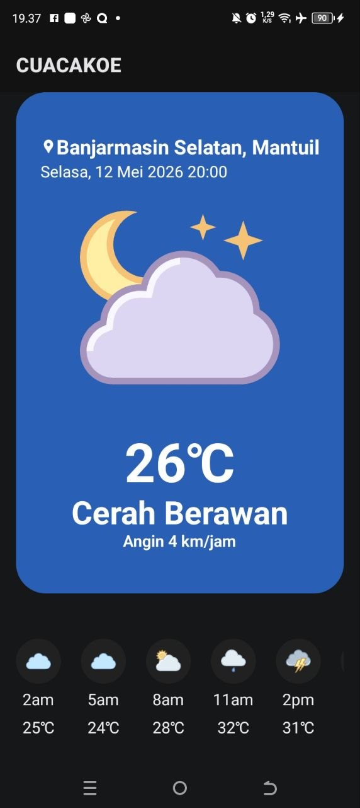
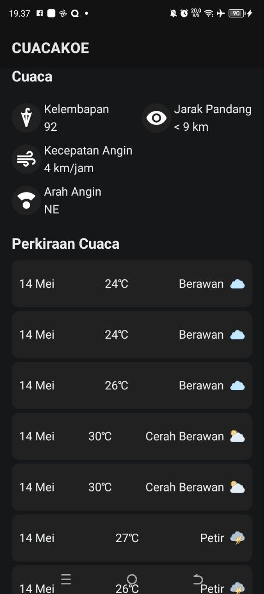

# Cuacakoe

Berikut adalah dokumentasi visual dan referensi dari proyek aplikasi Cuacakoe.

---

## Tangkapan Layar

Berikut adalah beberapa tampilan antarmuka dari aplikasi:

|                                    Beranda                                     |                                Mode Gelap                                |                                   Detail Cuaca                                   |
| :----------------------------------------------------------------------------: | :----------------------------------------------------------------------: | :------------------------------------------------------------------------------: |
|  |  |  |

---

## Video Demonstrasi

Lihat video singkat di bawah ini untuk melihat bagaimana aplikasi berjalan secara langsung:

<video src="./assets/preview/vidio-preview.mp4" width="100%" controls></video>

---

## Kredit & Apresiasi

Proyek ini menggunakan referensi desain dan data dari pihak berikut:

### Desain

- Desainer: [Amanda Permatasari](https://www.figma.com/@amandaprmtsr?fuid=1138778058941950836)
- Referensi: [Free Weather App - Forecazt (Community)](https://www.figma.com/community/file/1405018928544771665)

### Penyedia API

Aplikasi ini secara langsung mengambil data cuaca dari:

- Penyedia: [BMKG (Badan Meteorologi, Klimatologi, dan Geofisika) Republik Indonesia]
- Dokumentasi API: [Link Dokumentasi API BMKG](https://data.bmkg.go.id/prakiraan-cuaca/)

---

Dibuat menggunakan React Native & Expo.
